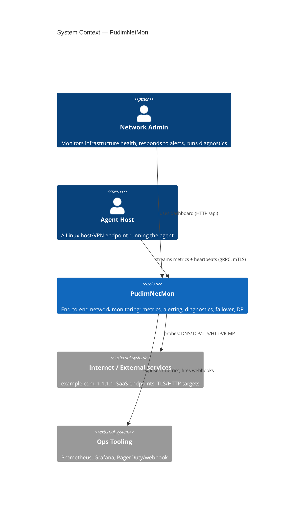
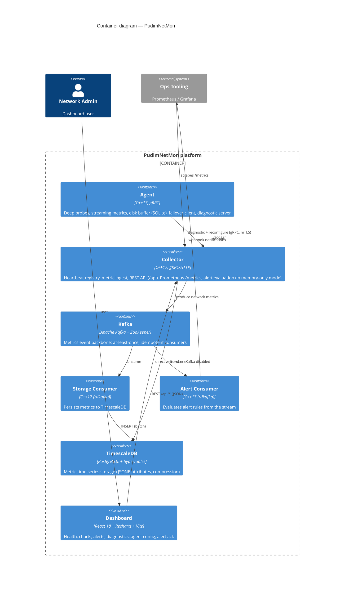
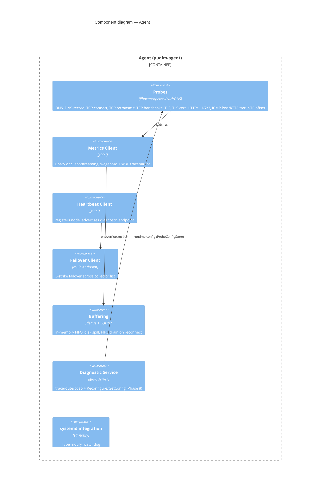
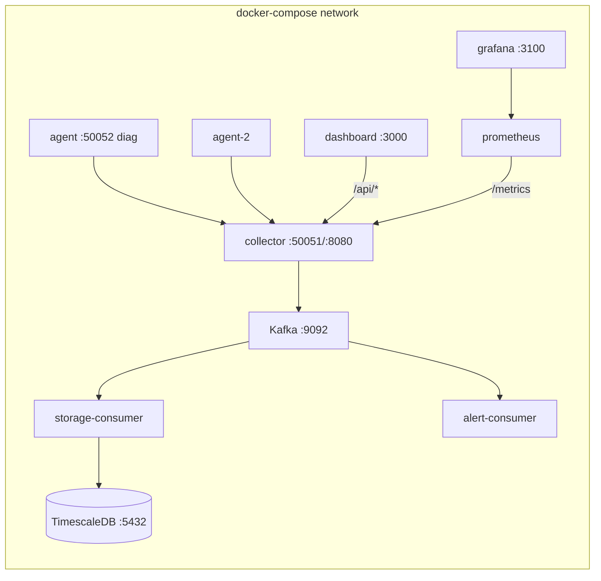

# PudimNetMon Architecture (C4 model)

PudimNetMon is a distributed network-monitoring platform: lightweight C++
agents run deep connectivity probes (DNS, TCP, TLS, HTTP, ICMP, pcap, NTP),
stream metrics to a collector, which persists to TimescaleDB, fans out to
Kafka, evaluates alert rules, and serves a React dashboard.

This document follows the [C4 model](https://c4model.com/): Context →
Container → Component.

---

## Level 1 — System Context



---

## Level 2 — Containers



---

## Level 3 — Collector (component view)

```mermaid
C4Component
  title Component diagram — Collector

  Container_Boundary(col, "Collector (pudim-collector)") {
    Component(grpc, "gRPC Services", "AgentService / MetricsService", "heartbeat registry, metric ingest, x-overloaded backpressure")
    Component(rest, "REST API", "cpp-httplib", "/api/health, /api/agents, /api/metrics, /api/alerts(+/ack), /api/alert-history, /api/alert-rules, /api/agents/config, /api/diagnostic")
    Component(prom, "Prometheus exporter", "text format", "pudim_* counters (heartbeats, alerts, lag)")
    Component(alert, "AlertManager", "state machine", "rules, firing/repeat/resolved, ack, webhook+log notifiers")
    Component(producer, "Kafka Producer", "librdkafka", "publishes metric batches")
    Component(diagclient, "Diagnostic Client", "gRPC", "forwards traceroute/pcap/reconfigure to agents")
    Component(storage, "TimescaleStorage", "libpq", "direct SQL when Kafka disabled")
  }

  Rel(grpc, alert, "evaluate()")
  Rel(grpc, producer, "produce()")
  Rel(grpc, storage, "insert()")
  Rel(rest, alert, "snapshots + Ack()")
  Rel(rest, diagclient, "RunDiagnostic/Reconfigure/GetConfig")
  Rel(alert, External("webhook", "Webhook endpoint"), "Notify()")
```

---

## Level 3 — Agent (component view)



---

## Key flows

1. **Ingest** — agent probes each interval → `MetricsBatch` → collector gRPC →
   Kafka topic `network.metrics` → storage + alert consumers (or direct SQL +
   inline alerting when Kafka is disabled).
2. **Failover / DR** — agent monitors its collector list; on 3 failures it
   switches to the next endpoint. Overflowing batches spill to the SQLite disk
   buffer and drain oldest-first on reconnect (RPO = buffer contents).
3. **Backpressure** — when collector ingest latency exceeds the threshold, the
   gRPC response sets `x-overloaded`; the agent backs off its interval.
4. **Diagnostics (Phase 4/8)** — dashboard POSTs to the collector, which
   forwards to the agent's DiagnosticService (mTLS): traceroute, short pcap
   capture, and runtime probe reconfiguration.
5. **Alerting** — rules evaluated per metric batch; transitions logged to the
   bounded history; `POST /api/alerts/ack` marks a firing alert acknowledged.

## Deployment (docker-compose)



Every agent↔collector RPC is mutually authenticated with `--tls-*` (see
[ADR 010](adr/010-mtls-agent-collector.md) and
[certificate-rotation.md](certificate-rotation.md)).

